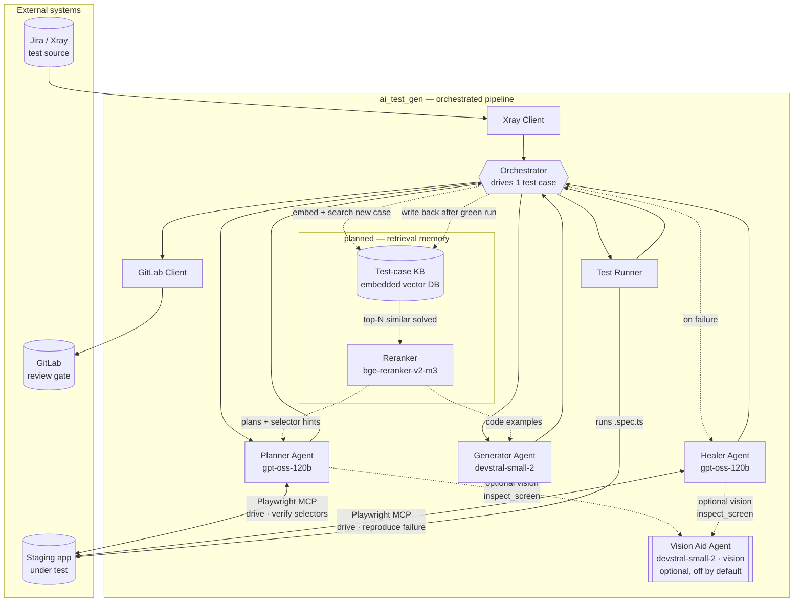
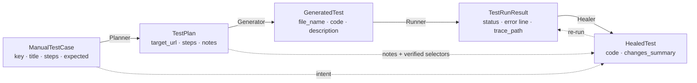
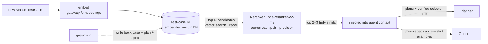

# Architecture — agentic-test-automation

> A one-page mental model of the whole system, finished parts and planned parts alike.
> For the step-by-step run flow and "which agent is called when", see [WORKFLOW.md](WORKFLOW.md).

## What it is, in one paragraph

An AI pipeline that turns a **manual Jira/Xray test case** into a **reviewed Playwright test** and opens a **GitLab merge request** — so QA reviews code instead of hand-writing it. Three narrow LLM agents (**Planner → Generator → Healer**) run on an **OpenAI-compatible model gateway**, drive a **real staging browser** through Playwright MCP, and verify their work against the live app. A human approves every MR; nothing is ever auto-merged, and the pipeline only ever runs against **staging, never production**.

## The five core ideas

1. **Three narrow agents beat one mega-prompt.** A single "convert this test case to Playwright" prompt works on a frontier model but is unreliable on mid-tier open-weights models. Splitting the job into three tightly-scoped roles — plan, generate, heal — makes each step's output far more dependable and lets us pick a different model per role.
2. **The browser is in the loop — the agents DRIVE the scenario, they don't just look.** The Planner and Healer open the live staging app via Playwright MCP (accessibility tree, no screenshots by default) and *perform* the flow — happy AND failure paths: log in, fill, submit, create data, trigger validation — so they capture a *verified* locator per element (most robust kind on the resilience ladder id → accessible → CSS → XPath; see "Selectors") AND observe what the app actually does (did it navigate? show an error? clear the form?). Driving for real is safe because the pipeline only ever runs against non-prod (the fail-closed URL guard). The Generator deliberately works blind from the plan, because a focused code model writes better code with less context.
3. **A structured artifact is the contract.** The Planner emits a typed `TestPlan` (JSON). Every downstream step consumes a precise schema instead of free text — no "what does success look like?" ambiguity between stages.
4. **Human review is the safety mechanism.** The pipeline's output is a GitLab MR labeled `ai-generated` + `qa-review-needed`. A person always approves before merge. The MR — not the model — is the gate.
5. **Staging-only, fail-closed.** Config refuses to start unless the target URL's host carries a non-prod marker. A misconfigured URL fails *before* any browser launches or any model is called.

## Component diagram

> Each agent's model is shown on its node. All of them — and the Vision Aid Agent — run on the same
> OpenAI-compatible gateway (optional mTLS); see "One gateway" under cross-cutting choices below.
> **The "planned — retrieval memory" group is not yet built:** the Test-case KB + Reranker (dotted
> connections) are the designed-but-unbuilt next extension — their embedding and rerank calls go to
> the *same* gateway (`/embeddings`, `/rerank`); see "Planned: retrieval memory" below.

## Components & responsibilities

| Component | Reads | Produces | Model / Browser |
|---|---|---|---|
| **Orchestrator** | one test-case key | per-case result + MR URL | — |
| **Test-case source** | a Jira ticket (Xray Client) **or** a raw-Xray-shaped JSON file (local loader) | `ManualTestCase` | — |
| **Planner Agent** | test case + live staging | `TestPlan` (verified selectors) | gpt-oss-120b · **MCP** |
| **Generator Agent** | `TestPlan` | `GeneratedTest` (`.spec.ts`) | devstral-small-2 · no browser |
| **Test Runner** | `GeneratedTest` | `TestRunResult` (pass/fail + trace) | — (runs Playwright) |
| **Healer Agent** | failed test + error + plan + intent + live staging | `HealedTest` (reconciled fix) | gpt-oss-120b · **MCP** (drives + reproduces) |
| **Vision Aid Agent** *(optional)* | a screenshot + a question (from the Planner or Healer) | a short text description of visual state | devstral-small-2 · vision |
| **GitLab Client** | per-attempt test revisions + plan | open MR (branch + one commit per attempt) | — |

All three pipeline agents and the glue around them — Test Runner, GitLab Client, Orchestrator — are built and unit-tested offline and wired into one end-to-end run. The Healer is a full browser agent like the Planner: it logs in fresh, drives the live app, and reproduces the failure (submitting forms, creating data, signing out + re-logging-in within the non-prod guard) rather than just reading the error. The Vision Aid Agent is an optional sensor both browser agents share — see the vision bullet below. A live run additionally needs the model gateway, the staging app, and — with the default `xray` source — the Jira/Xray tenant. The `local` source (`TESTCASE_SOURCE=local`) reads raw-Xray-shaped JSON files from disk instead, so no tenant is needed; the bundled demo (`packages/demo-notes-app/`) uses it to run the whole pipeline against a local app.

## The data contract

These typed Pydantic models *are* the interfaces between stages. Each step takes one and returns the next; Pydantic AI also uses them as the model's structured-output schema, so every field is described.

Defined in [`src/ai_test_gen/models.py`](../src/ai_test_gen/models.py).

Each `PlanStep` may also carry **distilled page context** the Planner observed live — `page_url` and
the enclosing `container` (e.g. `dialog 'Create user'`). The blind Generator uses `container` to
emit *scoped* locators (`page.getByRole('dialog').getBy…`), pre-empting the strict-mode collision
where a same-named element behind a dialog only appears at run time; the Healer sees the same
context when diagnosing. Both fields are optional extractions, never invented — a plan without
them behaves exactly as before.

A step that **asserts an outcome** also carries a verified proof, so the blind Generator never has to
invent one. `target_selector` verifies what the step *does*; **`assert_selector`** verifies what it
*proves* — a live-captured locator for the element that confirms the outcome (a post-login heading, a
success toast, the opened dialog), captured the same way as `target_selector`. `expected` stays
human prose (the `test.step` label), it is **not** a locator. The after-state assertion picks its
proof in order: `assert_selector` if set, else the recorded `page_url` (a `page.waitForURL(...)`,
locale-independent) for page loads, else the `container`/next verified target — and **never a
`getByText` manufactured from `expected` prose**, which was the source of hallucinated page-load
checks asserting text the app doesn't contain.

The Generator also **guards each step**: it wraps every plan step in `test.step('<action>', …)`, asserts
the target is visible *before* acting (`await expect(target, '…').toBeVisible()`), and — for a step that
opens a modal/menu or navigates — asserts the new state *after* using the step's verified proof
(`assert_selector`, else `page.waitForURL(page_url)`, else the dialog/next target).
A missing element then fails fast at the expect timeout with a labeled message naming the step, not a 60s
action timeout; and the step that *fails to open* a modal fails on its own line instead of the next step.
The Healer reads which guard fired to tell a wrong locator from a prior step whose effect never landed.

> The Healer additionally receives the originating `ManualTestCase` (intent), the `TestPlan`
> (including the Planner's `notes` + verified selectors), and the summaries of earlier heal attempts
> in the same run — not new artifacts, but extra context so it can **reconcile the failing code with
> the original intent** (add a step the Generator skipped, drop one it hallucinated) instead of
> reacting to the error text alone, and **build on previous fixes instead of undoing them**. It still
> stays within the one test case and prefers the smallest change that makes it correct and green.

## Package map (where each concern lives)

| Concern | Files |
|---|---|
| **Orchestration** | `orchestrator.py`, `scripts/run_one.py` (thin CLI) |
| **Agents** | `agents/planner.py`, `agents/generator.py`, `agents/healer.py` |
| **Agent context** | `agents/_context.py` — injects the human-authored context files |
| **Prompts** | `prompts/planner.md`, `prompts/generator.md`, `prompts/healer.md` |
| **Model access** | `llm.py` (gateway provider) + `mtls.py` (direct-connect, optional private CA + client cert) |
| **Browser** | `playwright_mcp.py` + `playwright-mcp-config.json` + `output/` (Playwright harness) |
| **Integrations** | `xray_client.py` / `local_testcases.py` (in) · `gitlab_client.py` (out) |
| **Config & guardrail** | `config.py` — central config + fail-closed prod-URL check |
| **Data models** | `models.py` |
| **Human-authored context** | `project_context.md` (→ all agents) · `project_map.md` (→ Planner/Healer only) |

## Cross-cutting design choices (why the moving parts exist)

- **One gateway, not a public API.** Every agent — Planner, Generator, Healer, and the optional Vision Aid Agent — reaches one OpenAI-compatible gateway via `llm.py`. The `mtls.py` policy connects *directly* (ignoring env proxies, which can silently drop the connection), optionally trusts a private CA, and attaches an optional mTLS client cert. The browser agents accept an optional per-agent **reasoning-effort** setting (`PLANNER_REASONING_EFFORT` / `HEALER_REASONING_EFFORT`) — sent only when set, never to the Generator, and only to be trusted after `scripts/step0d_verify_reasoning_effort.py` proves the gateway honors the param (gateways commonly drop unknown params silently; the check compares low- vs high-effort token usage).
- **Playwright MCP for browsing.** The agents see the page as an **accessibility tree** (roles/labels), not pixels — far smaller and more reliable for an LLM than raw DOM or screenshots. Launched as a pinned `node` subprocess over stdio (not `npx`, which breaks the init handshake on some machines). The toolset is **filtered** before the agents see it: code-execution tools (`browser_evaluate` and kin) are hidden — the model supplies data, never JS — and two tools whose generated schemas use JSON-Schema constructs strict structured-output backends cannot compile (`browser_drop`: `propertyNames`; `browser_network_request`: `minimum`/`maximum`) are dropped, so gateways that grammar-compile every advertised tool schema (e.g. vLLM's `xgrammar`) accept the request. Neither dropped tool plays a role in the planned flows, and a schema-scan test keeps future `@playwright/mcp` bumps grammar-clean.
- **Context injection is asymmetric.** Every agent gets `project_context.md` (conventions/quirks). Only the browser-driving agents (Planner, Healer) also get `project_map.md` (routes/flows). The Generator is kept lean on purpose — mid-tier models degrade past ~30K tokens, so fewer tokens = more reliable structured output. The loader strips the context files' HTML comments before injection and warns when template placeholders are still present.
- **History trimming exists but is OFF by default (experimental).** Every MCP browser tool result embeds a full accessibility snapshot, so a long exploration replays a heavy history — a real cost. A history processor on the Planner/Healer can trim it: setting `SNAPSHOT_HISTORY_KEEP=N` keeps the newest N snapshots plus **anchors** — the latest snapshot of every page where a `browser_generate_locator` capture happened, deduped per (page URL, dialog-open) so modal and page states coexist (`ANCHOR_SNAPSHOTS=off` for a pure chronological window); everything else is stubbed down to its action confirmation, and `browser_generate_locator` results are never trimmed, so captured locators are unlosable. **It ships disabled** because live runs showed mid-tier reasoning models losing coherence with trimming enabled — exploring less, giving up early, fabricating steps; the full untrimmed history is the proven-safe default until a controlled A/B shows a net win.
- **Context-driven login (no saved session).** Each generated test logs *itself* in as its first steps — as the role the scenario needs — using the disposable staging dummy credentials in `project_context.md`; the Planner/Healer log in live while exploring. There is no `storage_state` (sessions expire between runs, and most cases need a different role or register first).
- **Selectors: a resilience ladder, verified, never guessed.** The pipeline targets *any* app — fully accessible or barely accessible — so it does not prefer one fixed kind of locator. For each element the Planner/Healer pick the **most robust locator that element actually supports**, descending a ladder only as far as needed: **(1) stable id** → `getByTestId('…')`, **(2) accessible** → `getByRole`/`getByLabel`/`getByText`, **(3) stable CSS** → `locator('css=…')`, **(4) XPath** → `locator('xpath=//…')` (the legitimate last resort for *inaccessible* elements with no id, role, or stable text — common in older internal apps, and what human QA engineers already reach for). An id is not "better" than an XPath when the element has no id; the best locator is the highest rung the element genuinely supports. **No one should have to add `id`s to the app (or to `project_map.md`) just to make elements findable** — the agents extract a working locator from the live element. Every locator is captured + verified live, **never invented**: the primary path is Playwright MCP's read-only `browser_generate_locator` (the server sets `testIdAttribute: "id"`, so author-written `id`s surface as `getByTestId('…')` → `[id="…"]`, locale-independent — handy for multilingual apps, where text/role fallbacks may appear in any language); a CSS/XPath the agent *authors* for rungs 3–4 must be confirmed to resolve to the intended element (pass it as `browser_generate_locator`'s `target`, which accepts a unique selector, and/or use the `browser_verify_*` tools) before it is recorded. Name-based locators (`getByRole({ name })` / `getByText` / `getByLabel`) always carry **`exact: true`** (id/CSS/XPath do not) so a default substring match (`{ name: 'Add' }` ↔ "Add admin") can't trip a `strict mode violation … resolved N elements`; steps observed inside a dialog carry a `container` hint the Generator turns into a scoped locator. When a generated test keeps failing on the **same step**, the Healer **escalates the locator KIND** — descending the ladder to a different, verified kind (e.g. rolling a stuck id over to an XPath) rather than re-emitting the locator that already failed. The generated-test runner mirrors `testIdAttribute: 'id'` so id-based locators resolve at run time.
- **Browser agents act strictly sequentially.** Both browser agents always run with `parallel_tool_calls=false`: pydantic-ai executes a turn's tool calls *concurrently*, so a model that batches two browser actions into one turn can click/navigate out of order — and race a vision screenshot with the navigation it should observe. One tool call per turn is the only correct order for tools that mutate one shared page. (The gateway must honor the flag; OpenAI-compatible servers may silently drop it — verify on a real run.)
- **A locator hunt can never kill a run.** A `LocatorFailureGuard` hook wraps `browser_generate_locator` on both browser agents, always. Repeated failures on one element used to escalate into pydantic-ai's fatal "exceeded max retries", aborting the whole planning run or heal attempt — routine on barely-accessible apps. Now, at the retry ceiling (`AGENT_MCP_RETRIES`), the guard *returns* give-up-this-element guidance instead of raising: descend the ladder (author + verify a CSS/XPath, use `probe_dom` when enabled), or record the gap in notes and move on. Mid-streak — and only when vision is on — it steers the agent to `inspect_screen` first (`PLANNER_LOCATOR_STEER_AFTER`, default 3). `AGENT_REQUEST_LIMIT` remains the overall backstop.
- **Optional DOM Probe for the Planner AND Healer (off by default).** On an inaccessible (div-soup) app the accessibility snapshot — the agents' only DOM view — renders unnamed `generic` nodes, so a visible element (the modal's submit button) can be unfindable, and the ladder's CSS/XPath rungs have no data to author a candidate from. Setting `AGENT_DOM_PROBE=N` gives both browser agents a read-only `probe_dom(text, scope?)` tool: ONE fixed, pipeline-authored JS function executed through the MCP server (the model supplies only the search text and optional scope — data, never code; the raw `browser_evaluate` tool stays hidden from the agents). It returns each match's real tag / id / classes / attributes / visibility — flagging shadow-DOM and iframe placement — plus a *candidate* CSS and XPath selector with match counts. Candidates are reconnaissance, not locators of record: the agent must verify one via `browser_generate_locator` (which accepts a selector as `target`) before recording it, so "verify before trust" holds. Budget is per agent run, like the Vision Aid; no extra model is involved. Unset/`false` leaves prompts and toolset byte-identical.
- **Navigate like a user, trust the live page.** The Planner reaches features the way a person does — log in, then click the app's nav/menus — rather than typing or guessing URLs; it only navigates directly to the base URL or a route/URL the Application Map marks as addressable — including auxiliary tool UIs the map declares, e.g. a mail-catcher for email verification (many apps expose a feature only via in-app navigation, never a typed URL). It records into the plan only what it actually saw: a URL the live app rejected ("Page not found"/error/empty) is never written to `target_url`/`page_url`, and it doesn't emit a plan for a page it didn't visit. A sparse/empty accessibility snapshot is treated as "still loading or non-semantic controls" (climb the locator ladder / use vision) — not as grounds to refuse; refusal (empty `steps`) is reserved for unsafe/out-of-scope cases.
- **Execute fully; keep the spec; record divergence.** Because the agents actually perform the flow, side-effects become real plan steps: a failed login that clears the password produces an explicit re-fill step, so a "wrong-then-right password" test replays correctly. Declared **post-creation activation flows** are part of executing fully: when the context/map declare that a created record needs activation before first use (canonically, a new account's email-verification link on the map's mail-catcher UI), the agents perform those steps as real plan steps right after the creation and never use the record before they complete — and the Healer treats a fresh account's failing first login as an activation-gap suspect before a selector suspect. Assertions stay faithful to the manual test case's `expected` even when the live app contradicts it — if the case says a button is disabled but it stays enabled with a validation message, the generated test still asserts *disabled* (so it fails and surfaces a real bug) and the Planner records the contradiction in `notes`; the Healer does the same in `changes_summary` and leaves a genuine app bug as a faithfully-failing test rather than "fixing" it away.
- **Optional Vision Aid sensor for the Planner AND Healer (off by default).** The browser agents read the page as an accessibility tree, which can be silent about *visual* state — whether a dropdown actually opened, a modal/overlay is covering the page, a toast appeared, or a button is greyed out. Setting `AGENT_VISION=N` (the single shared knob) gives **both** text-only agents an `inspect_screen` tool: it captures a fresh screenshot of the **current** page itself (driving `browser_take_screenshot` on the live MCP, so the image can't be a stale, previous-page shot the model forgot to refresh) and asks the **Vision Aid Agent** — a vision-capable model (`VISION_MODEL`, default `devstral-small-2-2512`) — to describe what is rendered, returning a short two-part text answer the agent acts on: `Answer:` (the question, with a wrong premise flagged explicitly) plus `On screen:` (what the page actually shows — heading/title, main content, any dialog/overlay/toast/error). The unprompted `On screen:` part is what re-orients a *disoriented* agent — the moments it most needs vision are the moments it is least qualified to ask the right question, so a narrow answer alone ("no dialog is visible") would confirm a failure without correcting the wrong mental model behind it. A staleness guard remains only as a fallback for the rare case the self-capture fails. (Batching a vision question with a navigation in the same turn can't race the screenshot either — browser agents always run one tool call per turn; see "Browser agents act strictly sequentially".) It is a **sensor only**: the image never reaches the text agent, and the tool never yields a selector (targeting stays on `browser_generate_locator`). The budget is **per agent run** — N calls per planning run *and* N per heal attempt (each lifecycle starts fresh; not one shared pool). Unset / `false` leaves both agents' prompt and toolset byte-identical to before; it requires a multimodal model on the gateway. When the sensor is on, the always-attached locator guard additionally gains its **steer-to-vision stage**: after N consecutive `browser_generate_locator` failures (`PLANNER_LOCATOR_STEER_AFTER`, default 3, clamped below `AGENT_MCP_RETRIES`) it replaces the bare tool error with a `ModelRetry` that pushes the agent to `browser_take_screenshot` + `inspect_screen` and re-orient (repeated locator failures are usually a stale `ref` / wrong page / overlay, not a missing id) — and at the retry ceiling the guard soft-lands instead of aborting (see "A locator hunt can never kill a run"). Vision still never sources a selector.
- **Regression-safe test data.** Generated tests randomize the data they *create* (new user/org/project names, signup emails) **at run time** — a fresh suffix computed in the test, not a one-off literal baked in by the model — so reruns don't collide (`already exists`). Login credentials stay literal: they must match an existing account.
- **Pin everything.** Exact versions for Python deps, the Playwright MCP server, and the Playwright test runner — version drift masks whether a failure is ours or upstream's.

## What's built, and what's next

The pipeline runs end-to-end today: central config with the fail-closed prod-URL guardrail, the typed
data models, the Xray client, Playwright MCP with context-driven login, the three agents with their
prompts, the **Test Runner** (subprocess + hard timeout), the **GitLab MR creator** (collision-safe branch,
heal-attempt summaries, committed plan JSON), and the **Orchestrator** that runs Plan → Generate → Run →
Heal → MR for one case (heal cap — a crashed attempt is consumed and healing continues, stopping early
only on two consecutive crashes — `context_hash` in the saved plan, `output/snapshots/` auto-clean, each
iteration saved to its own `output/tests/` file, and the MR committing one revision per attempt to a single
file path under the first iteration's name so attempt-to-attempt diffs are visible in GitLab). Every
piece is unit-tested offline with Pydantic AI's `TestModel`. It also ships as a container — a
[`Dockerfile`](../Dockerfile) (official Playwright base, non-root `appuser`, pinned `uv`/`npm` deps) and
[`docker-compose.yml`](../docker-compose.yml) run it standalone, including a local mode without GitLab
(`GITLAB_ENABLED=false` skips the MR step).

Possible extensions, not yet built:

- **Continuous integration** — run the Orchestrator in the container, one job per test case, triggered when a
  Jira case is marked ready for automation.
- **Hardening for shared/production use** — secrets via a manager or CI variables; locked-down container
  network; read-only rootfs; PII redaction before model calls; per-call audit logging; tracing and metrics.
- **A Translator agent** — a 4th agent that migrates an existing Selenium suite to Playwright (same pipeline
  shape, different front door).
- **Retrieval memory** — an embedded database of solved test cases + a reranker, feeding the agents
  similar past work as examples. Designed in full in **"Planned: retrieval memory"** just below.
- **Reviewer conveniences** — visual-regression checks, MR notifications, a coverage dashboard, and
  auto-proposed `project_map.md` updates.

> The two human-authored context files (`project_context.md`, `project_map.md`) ship as **templates** — fill
> them in for your app before the first run.

## Planned: retrieval memory — an embedded test-case knowledge base + a reranker

> **Status: designed, not yet built.** Nothing in this section runs today. The groundwork *does*
> ship already: [`scripts/step0b_verify_embeddings.py`](../scripts/step0b_verify_embeddings.py)
> smoke-tests a gateway's `/embeddings` and `/rerank` endpoints (accepting the common response
> shapes), `.env.example` carries the `EMBEDDING_MODEL` / `RERANKER_MODEL` / `RERANK_ENDPOINT`
> settings, and the local vector-store directory is already gitignored.

**The idea in one paragraph.** Today every test case is planned from scratch, as if it were the
first — yet the pipeline *produces* the best possible reference material as it works: verified
plans, live-captured selectors, finished green specs. The retrieval memory keeps that output in an
**embedded vector database of solved test cases** and feeds the most similar past cases back to the
agents as examples. A new case then starts from "we've automated three cases just like this"
instead of from zero: less live exploration for the Planner, stronger few-shot examples for the
Generator, more consistent code across the suite, fewer heal loops. The memory compounds — **every
solved case makes the next one faster and cheaper.**

**The two new components.**

| Component | Reads | Produces | Runs on |
|---|---|---|---|
| **Test-case knowledge base** | every solved case: the manual case's text (embedded), its verified `TestPlan`, the final green spec, outcome metadata | the top-N nearest solved cases for a new case | an **embedded** vector DB — an in-process library persisting to a local directory, no extra service to operate (reference choice: Qdrant in local mode, whose `qdrant_storage/` dir is already gitignored; LanceDB/Chroma fit the same slot). The same client API points at a standalone server later if the index outgrows one machine. |
| **Reranker** | the new case + each candidate, as text *pairs* | the candidates re-scored for genuine relevance; only the top 2–3 survive | **`bge-reranker-v2-m3`** — a cross-encoder rerank model on the gateway's `/rerank` endpoint (the `.env.example` default; the endpoint is what `scripts/step0b_verify_embeddings.py` smoke-tests). |

**Why two stages (embed → rerank).** Embedding search is *recall*: fast and cheap, but coarse —
"create a user" and "delete a user" sit close together in vector space. The reranker is
*precision*: it reads the new case and one candidate **together** and scores actual relevance.
That second stage is what protects the prompt budget — mid-tier models degrade as context bloats
(the same reason context injection is asymmetric today), so the pipeline injects the 2–3 *right*
examples, never the 10 nearest ones. The reranker is the quality gate that keeps agent prompts lean.

**Who consumes what — asymmetric, like all context injection here.**

- **Planner** — similar cases' plans and their **verified selectors as hints** ("the last case on
  this screen used these locators"). Hints shrink live exploration — fewer browser turns, faster and
  cheaper planning — but are never trusted blindly: every selector in the new plan is still
  captured and verified live on the current app build (the never-invent rule and the resilience
  ladder are unchanged; the app may have changed since the hint was recorded).
- **Generator** — 2–3 similar finished specs as few-shot examples: "write something that looks like
  these." Consistent style across the suite and fewer compile-retry round-trips.
- **Healer** *(a later increment)* — past heal outcomes for similar failure fingerprints ("this
  failure was fixed by escalating the locator kind").

**The learning loop.** After a run goes green, the Orchestrator writes the solved case back — case
text, plan (verified selectors included), final spec, outcome. No manual curation. And the KB does
not start cold: an indexer CLI bulk-loads the existing corpus (manual test cases already automated
by hand, plus any pre-existing Playwright suite) before the first assisted run.

**Guardrails carry over unchanged.**

- **Off by default, fail-open.** A `RAG_ENABLED` flag ships `false`, like every optional capability
  here (vision, DOM probe, trimming). When it is on but the KB or the rerank endpoint is
  unreachable, the run proceeds exactly as today — retrieval is an accelerator, never a dependency.
- **Retrieved ≠ trusted.** Examples and selector hints are advisory context. Nothing from the KB
  reaches a test file without the normal live verify-before-record path.
- **Measured before enabled.** A retrieval-quality eval (does the top-3 actually contain a relevant
  case?) gates turning the flag on — the same evidence-first bar as the reasoning-effort and
  endpoint verifications.

Planned code layout: `src/ai_test_gen/rag/` — `embeddings.py` (gateway `/embeddings` + `/rerank`
calls), `indexer.py` (bulk load + write-back), `retriever.py` (search → rerank → top-k) — behind
the `RAG_ENABLED` config flag.

## Where to read more

- **Full build guide (code-level):** [`AI_TEST_GENERATION_GUIDE.md`](../AI_TEST_GENERATION_GUIDE.md)
- **Run flow & agent sequence:** [WORKFLOW.md](WORKFLOW.md)
- **Setup — install, configure, run:** [`SETUP.md`](../SETUP.md)
- **Project overview & adoption:** [`README.md`](../README.md)
