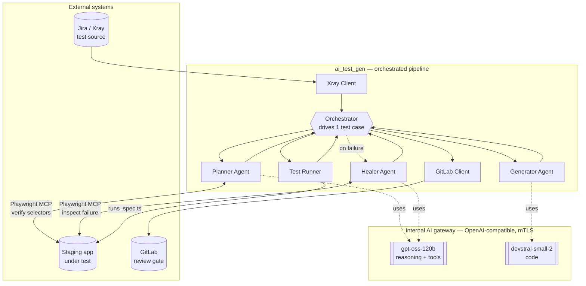
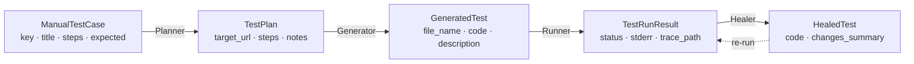
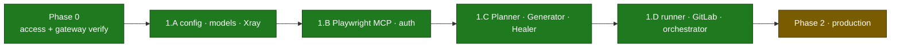

# Architecture — agentic-test-automation

> A one-page mental model of the whole system, finished parts and planned parts alike.
> For the step-by-step run flow and "which agent is called when", see [WORKFLOW.md](WORKFLOW.md).

## What it is, in one paragraph

An AI pipeline that turns a **manual Jira/Xray test case** into a **reviewed Playwright test** and opens a **GitLab merge request** — so QA reviews code instead of hand-writing it. Three narrow LLM agents (**Planner → Generator → Healer**) run on the company's **internal model gateway**, drive a **real staging browser** through Playwright MCP, and verify their work against the live app. A human approves every MR; nothing is ever auto-merged, and the pipeline only ever runs against **staging, never production**.

## The five core ideas

1. **Three narrow agents beat one mega-prompt.** A single "convert this test case to Playwright" prompt works on a frontier model but is unreliable on mid-tier open-weights models. Splitting the job into three tightly-scoped roles — plan, generate, heal — makes each step's output far more dependable and lets us pick a different model per role.
2. **The browser is in the loop.** The Planner and Healer don't guess selectors — they open the live staging app via Playwright MCP (accessibility tree, no screenshots) and capture each selector with the read-only `browser_generate_locator` tool before committing it. The Generator deliberately works blind from the plan, because a focused code model writes better code with less context.
3. **A structured artifact is the contract.** The Planner emits a typed `TestPlan` (JSON). Every downstream step consumes a precise schema instead of free text — no "what does success look like?" ambiguity between stages.
4. **Human review is the safety mechanism.** The pipeline's output is a GitLab MR labeled `ai-generated` + `qa-review-needed`. A person always approves before merge. The MR — not the model — is the gate.
5. **Staging-only, fail-closed.** Config refuses to start unless the target URL's host carries a non-prod marker. A misconfigured URL fails *before* any browser launches or any model is called.

## Component diagram

## Components & responsibilities

| Component | Reads | Produces | Model / Browser | Status |
|---|---|---|---|---|
| **Orchestrator** | one Jira key | per-case result + MR URL | — | ✅ built |
| **Xray Client** | Jira ticket | `ManualTestCase` | — | ✅ built |
| **Planner Agent** | test case + live staging | `TestPlan` (verified selectors) | gpt-oss-120b · **MCP** | ✅ built |
| **Generator Agent** | `TestPlan` | `GeneratedTest` (`.spec.ts`) | devstral-small-2 · no browser | ✅ built |
| **Test Runner** | `GeneratedTest` | `TestRunResult` (pass/fail + trace) | — (runs Playwright) | ✅ built |
| **Healer Agent** | failed test + error | `HealedTest` (minimal fix) | gpt-oss-120b · **MCP** | ✅ built |
| **GitLab Client** | final test + plan | open MR (branch + commit) | — | ✅ built |

All three agents plus the Phase 1.D glue — Test Runner, GitLab Client, Orchestrator — are now built and unit-tested offline; **Phase 1.D wired them** into one end-to-end run. The live end-to-end run is a company-laptop step.

## The data contract

These typed Pydantic models *are* the interfaces between stages. Each step takes one and returns the next; Pydantic AI also uses them as the model's structured-output schema, so every field is described.

Defined in [`src/ai_test_gen/models.py`](../src/ai_test_gen/models.py).

## Package map (where each concern lives)

| Concern | Files |
|---|---|
| **Orchestration** | `orchestrator.py`, `scripts/run_one.py` (thin CLI) |
| **Agents** | `agents/planner.py`, `agents/generator.py`, `agents/healer.py` |
| **Agent context** | `agents/_context.py` — injects the human-authored context files |
| **Prompts** | `prompts/planner.md`, `prompts/generator.md`, `prompts/healer.md` |
| **Model access** | `llm.py` (gateway provider) + `mtls.py` (direct-connect, corp CA, optional client cert) |
| **Browser** | `playwright_mcp.py` + `playwright-mcp-config.json` + `output/` (Playwright harness) |
| **Integrations** | `xray_client.py` (in) · `gitlab_client.py` (out) |
| **Config & guardrail** | `config.py` — central config + fail-closed prod-URL check |
| **Data models** | `models.py` |
| **Human-authored context** | `project_context.md` (→ all agents) · `project_map.md` (→ Planner/Healer only) |

## Cross-cutting design choices (why the moving parts exist)

- **Internal gateway, not a public API.** All three agents reach one OpenAI-compatible gateway via `llm.py`. The `mtls.py` policy connects *directly* (ignoring env proxies, which silently drop the connection), trusts the corporate CA, and attaches an optional mTLS client cert.
- **Playwright MCP for browsing.** The agents see the page as an **accessibility tree** (roles/labels), not pixels — far smaller and more reliable for an LLM than raw DOM or screenshots. Launched as a pinned `node` subprocess over stdio (not `npx`, which breaks the init handshake on some machines).
- **Context injection is asymmetric.** Every agent gets `project_context.md` (conventions/quirks). Only the browser-driving agents (Planner, Healer) also get `project_map.md` (routes/flows). The Generator is kept lean on purpose — mid-tier models degrade past ~30K tokens, so fewer tokens = more reliable structured output.
- **Context-driven login (no saved session).** Each generated test logs *itself* in as its first steps — as the role the scenario needs — using the disposable staging dummy credentials in `project_context.md`; the Planner/Healer log in live while exploring. There is no `storage_state` (sessions expire between runs, and most cases need a different role or register first).
- **Selectors: verified, never guessed.** The accessibility tree carries no `id`s to read, so the Planner/Healer call Playwright MCP's read-only `browser_generate_locator` to capture a real locator per element instead of hand-writing one. The server sets `testIdAttribute: "id"`, so this team's manually-written `id` attributes surface as `getByTestId('…')` (resolves to `[id="…"]`); elements without an id fall back to `getByRole`/`getByLabel`. The apps are **bilingual (EN/DE)**, so text/role fallbacks may be in either language — another reason the id-based locators (locale-independent) are preferred. The generated-test runner mirrors `testIdAttribute: 'id'` so those locators resolve at run time.
- **Pin everything.** Exact versions for Python deps, the Playwright MCP server, and the Playwright test runner — version drift during a PoC masks whether a failure is ours or upstream's.

## Build phases & current status

- ✅ **Phase 0** — internal access + gateway/tool-calling/Xray-flavor verification scripts.
- ✅ **Phase 1.A–1.C** — config + guardrail, data models, Xray client, Playwright MCP + auth, and the three agents with their prompts. Exercised offline (no gateway, no browser) with Pydantic AI's `TestModel`.
- ✅ **Phase 1.D** — the end-to-end glue: **Test Runner** (subprocess + hard timeout), **GitLab MR creator** (collision-safe branch, heal-attempt summaries, committed plan JSON), and the **Orchestrator** that runs Plan → Generate → Run → Heal → MR for one case (heal cap, `context_hash` in the saved plan, `output/snapshots/` auto-clean). Unit-tested offline; the live end-to-end run is a company-laptop step.
- 🗺️ **Phase 2 (production)** — Dockerized batch job on GitLab CI; secrets via CI variables/Vault; OpenTelemetry tracing; security hardening (locked-down network, non-root, no-PII redaction, audit logging); batch processing; a 4th **Translator** agent for Selenium→Playwright migration; and **RAG** (Qdrant + embed/rerank) to feed the Generator real examples.
- 📌 **Beyond** — visual regression, parallel CI fan-out, Slack/Teams MR notifications, a coverage dashboard, and auto-proposed `project_map.md` updates.

> The two human-authored context files (`project_context.md`, `project_map.md`) currently ship as **templates** — filling them in for the target app is part of Phase 1.

## Where to read more

- **Full build guide (all phases, code-level):** [`AI_TEST_GENERATION_GUIDE.md`](../AI_TEST_GENERATION_GUIDE.md)
- **Run flow & agent sequence:** [WORKFLOW.md](WORKFLOW.md)
- **Setup (private PC + company laptop):** [`SETUP.md`](../SETUP.md)
- **Project status & adoption:** [`README.md`](../README.md)
