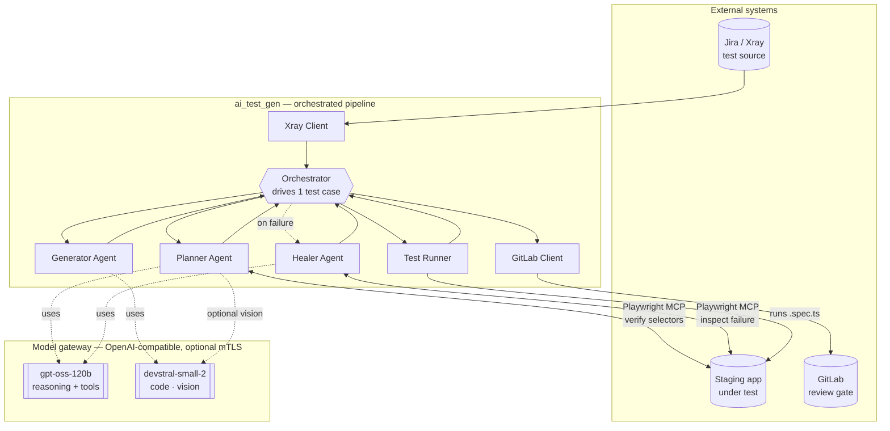
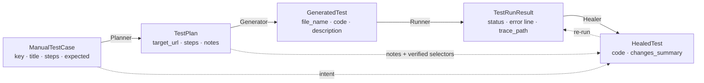

# Architecture — agentic-test-automation

> A one-page mental model of the whole system, finished parts and planned parts alike.
> For the step-by-step run flow and "which agent is called when", see [WORKFLOW.md](WORKFLOW.md).

## What it is, in one paragraph

An AI pipeline that turns a **manual Jira/Xray test case** into a **reviewed Playwright test** and opens a **GitLab merge request** — so QA reviews code instead of hand-writing it. Three narrow LLM agents (**Planner → Generator → Healer**) run on an **OpenAI-compatible model gateway**, drive a **real staging browser** through Playwright MCP, and verify their work against the live app. A human approves every MR; nothing is ever auto-merged, and the pipeline only ever runs against **staging, never production**.

## The five core ideas

1. **Three narrow agents beat one mega-prompt.** A single "convert this test case to Playwright" prompt works on a frontier model but is unreliable on mid-tier open-weights models. Splitting the job into three tightly-scoped roles — plan, generate, heal — makes each step's output far more dependable and lets us pick a different model per role.
2. **The browser is in the loop.** The Planner and Healer don't guess selectors — they open the live staging app via Playwright MCP (accessibility tree, no screenshots by default) and capture each selector with the read-only `browser_generate_locator` tool before committing it. The Generator deliberately works blind from the plan, because a focused code model writes better code with less context.
3. **A structured artifact is the contract.** The Planner emits a typed `TestPlan` (JSON). Every downstream step consumes a precise schema instead of free text — no "what does success look like?" ambiguity between stages.
4. **Human review is the safety mechanism.** The pipeline's output is a GitLab MR labeled `ai-generated` + `qa-review-needed`. A person always approves before merge. The MR — not the model — is the gate.
5. **Staging-only, fail-closed.** Config refuses to start unless the target URL's host carries a non-prod marker. A misconfigured URL fails *before* any browser launches or any model is called.

## Component diagram

## Components & responsibilities

| Component | Reads | Produces | Model / Browser |
|---|---|---|---|
| **Orchestrator** | one Jira key | per-case result + MR URL | — |
| **Xray Client** | Jira ticket | `ManualTestCase` | — |
| **Planner Agent** | test case + live staging | `TestPlan` (verified selectors) | gpt-oss-120b · **MCP** |
| **Generator Agent** | `TestPlan` | `GeneratedTest` (`.spec.ts`) | devstral-small-2 · no browser |
| **Test Runner** | `GeneratedTest` | `TestRunResult` (pass/fail + trace) | — (runs Playwright) |
| **Healer Agent** | failed test + error + plan + intent | `HealedTest` (reconciled fix) | gpt-oss-120b · **MCP** |
| **GitLab Client** | final test + plan | open MR (branch + commit) | — |

All three agents and the glue around them — Test Runner, GitLab Client, Orchestrator — are built and unit-tested offline and wired into one end-to-end run. A live run additionally needs the model gateway, the staging app, and the Jira/Xray tenant.

## The data contract

These typed Pydantic models *are* the interfaces between stages. Each step takes one and returns the next; Pydantic AI also uses them as the model's structured-output schema, so every field is described.

Defined in [`src/ai_test_gen/models.py`](../src/ai_test_gen/models.py).

Each `PlanStep` may also carry **distilled page context** the Planner observed live — `page_url` and
the enclosing `container` (e.g. `dialog 'Create user'`). The blind Generator uses `container` to
emit *scoped* locators (`page.getByRole('dialog').getBy…`), pre-empting the strict-mode collision
where a same-named element behind a dialog only appears at run time; the Healer sees the same
context when diagnosing. Both fields are optional extractions, never invented — a plan without
them behaves exactly as before.

> The Healer additionally receives the originating `ManualTestCase` (intent), the `TestPlan`
> (including the Planner's `notes` + verified selectors), and the summaries of earlier heal attempts
> in the same run — not new artifacts, but extra context so it can **reconcile the failing code with
> the original intent** (add a step the Generator skipped, drop one it hallucinated) instead of
> reacting to the error text alone, and **build on previous fixes instead of undoing them**. It still
> stays within the one test case and prefers the smallest change that makes it correct and green.

## Package map (where each concern lives)

| Concern | Files |
|---|---|
| **Orchestration** | `orchestrator.py`, `scripts/run_one.py` (thin CLI) |
| **Agents** | `agents/planner.py`, `agents/generator.py`, `agents/healer.py` |
| **Agent context** | `agents/_context.py` — injects the human-authored context files |
| **Prompts** | `prompts/planner.md`, `prompts/generator.md`, `prompts/healer.md` |
| **Model access** | `llm.py` (gateway provider) + `mtls.py` (direct-connect, optional private CA + client cert) |
| **Browser** | `playwright_mcp.py` + `playwright-mcp-config.json` + `output/` (Playwright harness) |
| **Integrations** | `xray_client.py` (in) · `gitlab_client.py` (out) |
| **Config & guardrail** | `config.py` — central config + fail-closed prod-URL check |
| **Data models** | `models.py` |
| **Human-authored context** | `project_context.md` (→ all agents) · `project_map.md` (→ Planner/Healer only) |

## Cross-cutting design choices (why the moving parts exist)

- **One gateway, not a public API.** All three agents reach one OpenAI-compatible gateway via `llm.py`. The `mtls.py` policy connects *directly* (ignoring env proxies, which can silently drop the connection), optionally trusts a private CA, and attaches an optional mTLS client cert. The browser agents accept an optional per-agent **reasoning-effort** setting (`PLANNER_REASONING_EFFORT` / `HEALER_REASONING_EFFORT`) — sent only when set, never to the Generator, and only to be trusted after `scripts/step0d_verify_reasoning_effort.py` proves the gateway honors the param (gateways commonly drop unknown params silently; the check compares low- vs high-effort token usage).
- **Playwright MCP for browsing.** The agents see the page as an **accessibility tree** (roles/labels), not pixels — far smaller and more reliable for an LLM than raw DOM or screenshots. Launched as a pinned `node` subprocess over stdio (not `npx`, which breaks the init handshake on some machines).
- **Context injection is asymmetric.** Every agent gets `project_context.md` (conventions/quirks). Only the browser-driving agents (Planner, Healer) also get `project_map.md` (routes/flows). The Generator is kept lean on purpose — mid-tier models degrade past ~30K tokens, so fewer tokens = more reliable structured output. The loader strips the context files' HTML comments before injection and warns when template placeholders are still present.
- **History trimming exists but is OFF by default (experimental).** Every MCP browser tool result embeds a full accessibility snapshot, so a long exploration replays a heavy history — a real cost. A history processor on the Planner/Healer can trim it: setting `SNAPSHOT_HISTORY_KEEP=N` keeps the newest N snapshots plus **anchors** — the latest snapshot of every page where a `browser_generate_locator` capture happened, deduped per (page URL, dialog-open) so modal and page states coexist (`ANCHOR_SNAPSHOTS=off` for a pure chronological window); everything else is stubbed down to its action confirmation, and `browser_generate_locator` results are never trimmed, so captured locators are unlosable. **It ships disabled** because live runs showed mid-tier reasoning models losing coherence with trimming enabled — exploring less, giving up early, fabricating steps; the full untrimmed history is the proven-safe default until a controlled A/B shows a net win.
- **Context-driven login (no saved session).** Each generated test logs *itself* in as its first steps — as the role the scenario needs — using the disposable staging dummy credentials in `project_context.md`; the Planner/Healer log in live while exploring. There is no `storage_state` (sessions expire between runs, and most cases need a different role or register first).
- **Selectors: verified, never guessed.** The accessibility tree carries no `id`s to read, so the Planner/Healer call Playwright MCP's read-only `browser_generate_locator` to capture a real locator per element instead of hand-writing one. The server sets `testIdAttribute: "id"`, so the app's manually-written `id` attributes surface as `getByTestId('…')` (resolves to `[id="…"]`); elements without an id fall back to `getByRole`/`getByLabel`. If the app is **multilingual**, text/role fallbacks may appear in any of its languages — another reason the id-based locators (locale-independent) are preferred. Name-based locators (`getByRole({ name })` / `getByText` / `getByLabel`) always carry **`exact: true`** — the Planner records it and the Generator adds it if a plan locator lacks it — so a default substring match (`{ name: 'Add' }` ↔ "Add admin") can't trip a `strict mode violation … resolved N elements`; steps the Planner observed inside a dialog carry a `container` hint that the Generator turns into a scoped locator (same-name-behind-a-dialog collisions never reach run time), and the Healer's failure-mode catalog adds `exact` / dialog-scoping if a generated test hits one anyway. The generated-test runner mirrors `testIdAttribute: 'id'` so those locators resolve at run time.
- **Optional vision sensor for the Planner (off by default).** The Planner reads the page as an accessibility tree, which can be silent about *visual* state — whether a dropdown actually opened, a modal/overlay is covering the page, or a toast appeared. Setting `PLANNER_VISION=N` gives the (text-only) Planner an `inspect_screen` tool: it screenshots the page and asks a vision-capable model (`VISION_MODEL`, default `devstral-small-2-2512`) to describe what is rendered, returning a short text answer the Planner acts on — up to N calls per run, with a freshness guard that rejects a stale screenshot. It is a **sensor only**: the image never reaches the text Planner, and the tool never yields a selector (targeting stays on `browser_generate_locator`). Unset / `false` leaves the Planner's prompt and toolset byte-identical to before; it requires a multimodal model on the gateway.
- **Regression-safe test data.** Generated tests randomize the data they *create* (new user/org/project names, signup emails) **at run time** — a fresh suffix computed in the test, not a one-off literal baked in by the model — so reruns don't collide (`already exists`). Login credentials stay literal: they must match an existing account.
- **Pin everything.** Exact versions for Python deps, the Playwright MCP server, and the Playwright test runner — version drift masks whether a failure is ours or upstream's.

## What's built, and what's next

The pipeline runs end-to-end today: central config with the fail-closed prod-URL guardrail, the typed
data models, the Xray client, Playwright MCP with context-driven login, the three agents with their
prompts, the **Test Runner** (subprocess + hard timeout), the **GitLab MR creator** (collision-safe branch,
heal-attempt summaries, committed plan JSON), and the **Orchestrator** that runs Plan → Generate → Run →
Heal → MR for one case (heal cap, `context_hash` in the saved plan, `output/snapshots/` auto-clean). Every
piece is unit-tested offline with Pydantic AI's `TestModel`. It also ships as a container — a
[`Dockerfile`](../Dockerfile) (official Playwright base, non-root `appuser`, pinned `uv`/`npm` deps) and
[`docker-compose.yml`](../docker-compose.yml) run it standalone, including a local mode without GitLab
(`GITLAB_ENABLED=false` skips the MR step).

Possible extensions, not yet built:

- **Continuous integration** — run the Orchestrator in the container, one job per test case, triggered when a
  Jira case is marked ready for automation.
- **Hardening for shared/production use** — secrets via a manager or CI variables; locked-down container
  network; read-only rootfs; PII redaction before model calls; per-call audit logging; tracing and metrics.
- **A Translator agent** — a 4th agent that migrates an existing Selenium suite to Playwright (same pipeline
  shape, different front door).
- **RAG-assisted generation** — retrieve 2–3 similar existing tests (vector search + rerank) and inject them
  as examples for the Generator.
- **Reviewer conveniences** — visual-regression checks, MR notifications, a coverage dashboard, and
  auto-proposed `project_map.md` updates.

> The two human-authored context files (`project_context.md`, `project_map.md`) ship as **templates** — fill
> them in for your app before the first run.

## Where to read more

- **Full build guide (code-level):** [`AI_TEST_GENERATION_GUIDE.md`](../AI_TEST_GENERATION_GUIDE.md)
- **Run flow & agent sequence:** [WORKFLOW.md](WORKFLOW.md)
- **Setup — install, configure, run:** [`SETUP.md`](../SETUP.md)
- **Project overview & adoption:** [`README.md`](../README.md)
