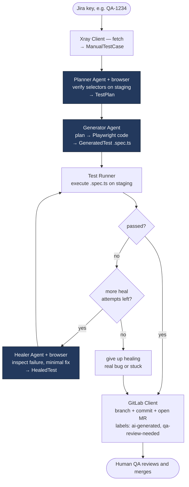
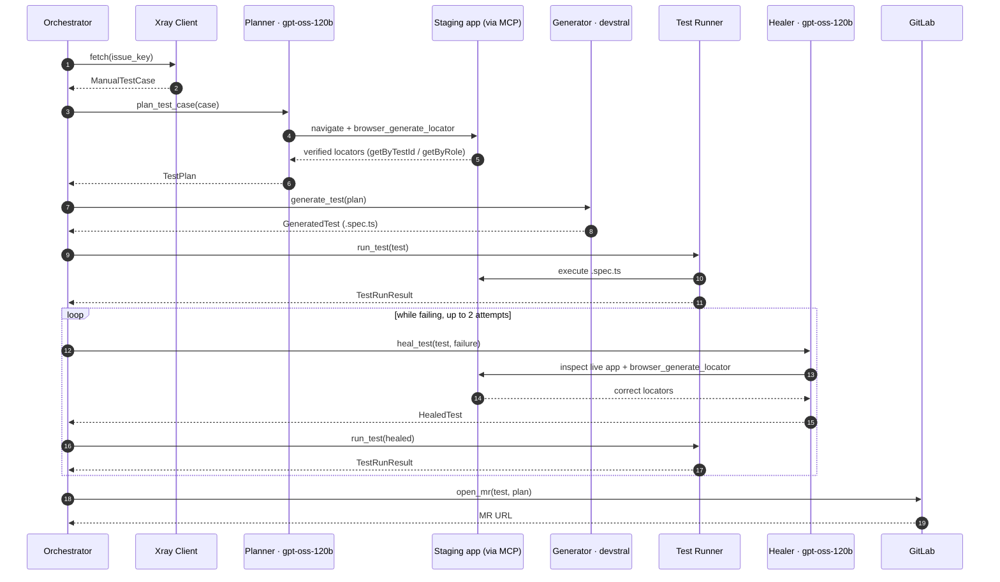
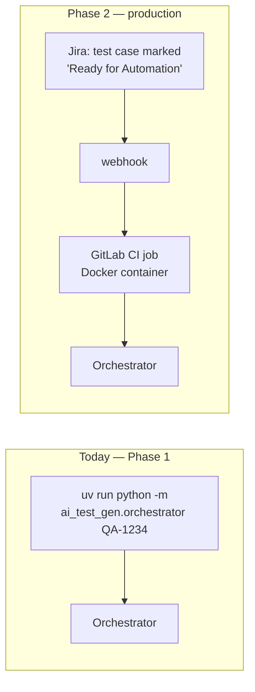

# Workflow — how one test case flows through the pipeline

> The run-time view: what happens, in what order, and which agent is called when.
> For the component/structure view, see [ARCHITECTURE.md](ARCHITECTURE.md).

The whole pipeline processes **one Jira/Xray test case at a time**. The Orchestrator runs this sequence: **fetch → plan → generate → run → (heal ↺) → open MR**.

## End-to-end flow

**Agents are blue.** Note the two browser-driving agents (Planner, Healer) and the single non-browser one (Generator). The loop back from Healer to Runner is the self-healing retry.

## Which agent is called when

## Stage by stage

| # | Stage | Who | In → Out | Touches | ~Time |
|---|---|---|---|---|---|
| 1 | Fetch | Xray Client | Jira key → `ManualTestCase` | Jira/Xray API | <1s |
| 2 | Plan | **Planner** (+MCP) | case → `TestPlan` | reads staging in a browser | 30–90s |
| 3 | Generate | **Generator** | `TestPlan` → `GeneratedTest` | none (writes file) | 10–20s |
| 4 | Run | Test Runner | test → `TestRunResult` | runs the test on staging | 10–60s |
| 5 | Heal *(only if step 4 failed)* | **Healer** (+MCP) | failed test + error → `HealedTest`, then back to step 4 | reads staging | 30–60s / attempt |
| 6 | Open MR | GitLab Client | final test + plan → MR URL | pushes branch, opens MR | <2s |

**Total: ~2–4 minutes per test case.**

## The heal loop, explained

- The Runner **never throws on a failing test** — a failure is a *healable state*, not a crash. (A genuinely hung run is caught by a hard timeout and reported as `status=error`, so the pipeline can't wedge.)
- While the test is failing, the Orchestrator calls the Healer up to **`MAX_HEAL_ATTEMPTS = 2`** times. Each attempt: Healer inspects the live app, makes a *minimal* fix (it never re-plans or adds tests), then the Runner re-runs it.
- The Healer is told to **leave the test unchanged if the failure is a genuine app bug** rather than a selector problem — so a real regression surfaces honestly instead of being "fixed" away.
- **If it still fails after 2 attempts, the MR is opened anyway.** Healing is a convenience, not a gate — a human reviews every result regardless. The MR labels (`ai-generated`, `qa-review-needed`) and the committed plan JSON give the reviewer full context.
- **Reviewers see the heal history.** Each attempt's `changes_summary`, the heal count, and the final status are rendered into the MR description — tests that needed multiple rounds are easy to spot and scrutinize.
- **Run housekeeping.** At the start of every run the Orchestrator empties `output/snapshots/` (the regenerated MCP snapshot/png output, kept out of git via a `.gitkeep` + ignored contents), and it stamps the saved plan JSON with a `context_hash` (sha256 of `project_context.md` + `project_map.md`) so a plan built against stale context is auditable later.

## What triggers a run

- **Now:** run by hand on the company laptop, one Jira key at a time. Each agent and the generated test log in live from the `project_context.md` dummy creds (context-driven auth — no saved session).
- **Phase 2:** a Jira status change webhooks GitLab CI, which runs the same Orchestrator inside a locked-down container — one CI job per test case, fanned out for batches.

## How this grows (planned)

- **Translator (4th agent).** For migrating the existing Selenium suite: `Selenium test → Translator (+MCP) → Playwright test → Runner → (Healer) → MR`. Same pipeline shape, different front door.
- **RAG-assisted Generator.** Once enough Playwright tests exist in the repo, the Generator first retrieves 2–3 similar existing tests (Qdrant vector search → cross-encoder rerank) and injects them as examples — "write something that looks like these" markedly improves output. This is the only change to the core loop; everything else stays the same.
