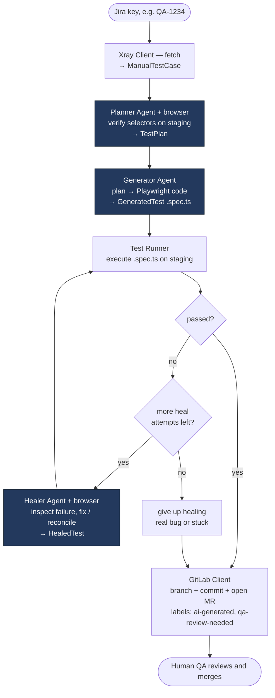
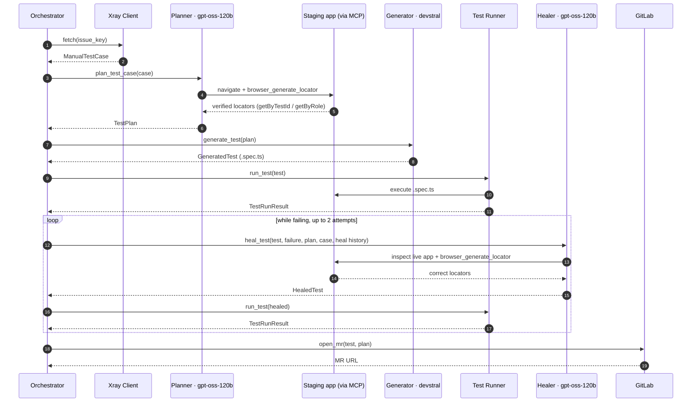
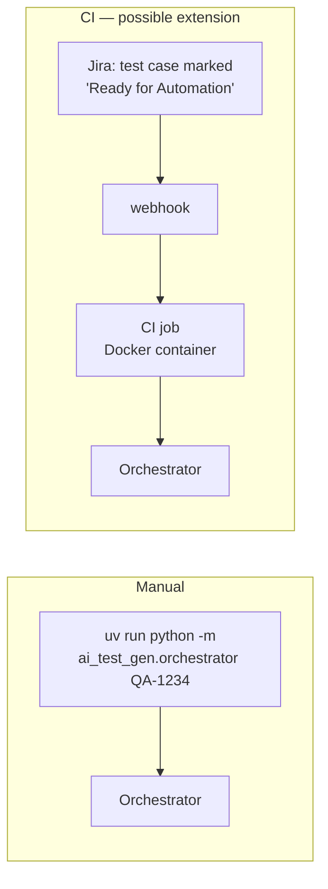

# Workflow — how one test case flows through the pipeline

> The run-time view: what happens, in what order, and which agent is called when.
> For the component/structure view, see [ARCHITECTURE.md](ARCHITECTURE.md).

The whole pipeline processes **one Jira/Xray test case at a time**. The Orchestrator runs this sequence: **fetch → plan → generate → run → (heal ↺) → open MR**.

## End-to-end flow

**Agents are blue.** Note the two browser-driving agents (Planner, Healer) and the single non-browser one (Generator). The loop back from Healer to Runner is the self-healing retry.

**Planner refusals short-circuit the run.** The Planner is instructed to refuse unclear or unsafe cases (forbidden routes, PII, production) by returning a plan with **no steps** and the reason in `notes`. The Orchestrator stops right there — no generation, no run, no heal attempts, no MR — and reports `status: refused` with those notes. The plan JSON is still saved for audit.

## Which agent is called when

## Stage by stage

| # | Stage | Who | In → Out | Touches | ~Time |
|---|---|---|---|---|---|
| 1 | Fetch | Xray Client | Jira key → `ManualTestCase` | Jira/Xray API | <1s |
| 2 | Plan | **Planner** (+MCP) | case → `TestPlan` (verified selectors + page context) | reads staging in a browser | 30–90s |
| 3 | Generate | **Generator** | `TestPlan` → `GeneratedTest` (container-scoped locators) | none (writes file) | 10–20s |
| 4 | Run | Test Runner | test → `TestRunResult` | runs the test on staging | 10–60s |
| 5 | Heal *(only if step 4 failed)* | **Healer** (+MCP) | failed test + error + plan + intent → `HealedTest`, then back to step 4 | reads staging | 30–60s / attempt |
| 6 | Open MR *(skipped if `GITLAB_ENABLED=false`)* | GitLab Client | final test + plan → MR URL | pushes branch, opens MR | <2s |

**Total: ~2–4 minutes per test case.**

## The heal loop, explained

- The Runner **never throws on a failing test** — a failure is a *healable state*, not a crash. (A genuinely hung run is caught by a hard timeout and reported as `status=error`, so the pipeline can't wedge.)
- **Compile errors never reach the Healer.** A run that produced no JSON report (`did_run=false` — the spec failed to compile/collect and never executed) goes back to the **Generator** for one regeneration with its own code + the error text. No browser is involved; only a test that actually *ran* enters the heal loop. A persistent compile error still falls through to the MR so a human sees it.
- While the test is failing, the Orchestrator calls the Healer up to **`MAX_HEAL_ATTEMPTS = 2`** times. Each attempt: the Healer inspects the live app and makes the smallest change that turns the test green — usually a selector/wait/URL fix, but it MAY add a step the Generator skipped or drop one it hallucinated to reconcile the test with its intent. It never re-plans from scratch or adds unrelated test cases.
- **The Healer reconciles against the original intent.** It also receives the `ManualTestCase` and the `TestPlan` (incl. the Planner's `notes`, verified selectors, and each step's plan-time page context — `page_url` / enclosing `container`), so it compares what the test *should* do against the failing code — staying faithful to that intent (never going green by dropping a real check) and verifying any selector it adds live via `browser_generate_locator`, never inventing one.
- **Each attempt sees the previous attempts' changes.** The accumulated `changes_summary` history is in the heal message with an explicit "the code already contains these changes — don't undo them" instruction, so a whole-file rewrite on attempt 2 builds on attempt 1 instead of ping-ponging back.
- **Diagnosis starts at the line the run died.** The runner extracts the failing line from the Playwright report (`error_line`), and the heal message quotes it with an explicit boundary: code after it **never executed** (don't "fix" it for this failure), code before it may have silently mis-acted — a wrong early locator usually surfaces as a *downstream* timeout. The Healer replays the test's locators in order from the top (login first) to find the first real blocker.
- **The Healer has a failure-mode catalog** — locator timeout, wrong URL, language mismatch, and **strict-mode violations** (`resolved N elements`), which it fixes by making the name match `exact: true` or scoping to the active dialog. It re-derives selectors via `browser_generate_locator` rather than hand-writing them.
- The Healer is told to **leave the test unchanged if the failure is a genuine app bug** rather than a selector problem — so a real regression surfaces honestly instead of being "fixed" away.
- **If it still fails after 2 attempts, the MR is opened anyway.** Healing is a convenience, not a gate — a human reviews every result regardless. The MR labels (`ai-generated`, `qa-review-needed`) and the committed plan JSON give the reviewer full context.
- **Reviewers see the heal history.** Each attempt's `changes_summary`, the heal count, and the final status are rendered into the MR description — tests that needed multiple rounds are easy to spot and scrutinize.
- **Every iteration is kept on disk; the MR carries one clean file.** The first generated spec keeps its name in `output/tests/`; the compile-retry regeneration and each heal attempt are written to their *own* sibling files — `<name>.regen.spec.ts`, `<name>.healer-attempt-1.spec.ts`, `<name>.healer-attempt-2.spec.ts` — so no iteration overwrites another and the whole heal history stays inspectable locally. The MR commits **only the final code, under the original first-iteration filename** (the Healer's own returned `file_name` is deliberately ignored), so a reviewer sees one file, not the attempt chain.
- **Run housekeeping.** At the start of every run the Orchestrator empties `output/snapshots/` (the regenerated MCP snapshot/png output, kept out of git via a `.gitkeep` + ignored contents), and it stamps the saved plan JSON with a `context_hash` (sha256 of `project_context.md` + `project_map.md`) so a plan built against stale context is auditable later.
- **Working-memory trimming (Planner & Healer) — optional, off by default.** The browser agents *can* trim stale page snapshots from their conversation history (`SNAPSHOT_HISTORY_KEEP` enables it; milestone pages where locators were captured are anchored, transit frames stubbed, captured locators never trimmed). It ships **disabled**: live runs showed plan quality degrade with trimming on, so the full history is the default. See the trimming bullet in [ARCHITECTURE.md](ARCHITECTURE.md) and `.env.example`.
- **Vision sensor (Planner) — optional, off by default.** Set `PLANNER_VISION=N` to give the text-only Planner an `inspect_screen` tool: it screenshots the page and asks a vision-capable model (`VISION_MODEL`) to describe what is actually rendered — useful when the accessibility snapshot is silent about visual state (did a dropdown open? is a modal/overlay covering the page? did a toast appear?), up to N calls per run. It is a sensor only — the image never reaches the Planner, and it never produces a selector. Unset/`false` leaves the Planner identical to before; requires a multimodal gateway model. See the vision bullet in [ARCHITECTURE.md](ARCHITECTURE.md) and `.env.example`.
- **GitLab is optional.** With `GITLAB_ENABLED=false` (e.g. a local Docker run) the pipeline stops after the run/heal loop and leaves the test + plan in `output/` — no branch, no MR (default is `true`, so a normal run still opens one). The direct-connect proxy policy covers the Xray + GitLab `requests` clients too, so the container reaches them without an env proxy.

## What triggers a run

- **Manual:** run it by hand, one Jira key at a time. Each agent and the generated test log in live from the `project_context.md` dummy creds (context-driven auth — no saved session); any data a test *creates* is randomized at run time, so the same test can be replayed in regression without colliding. The same container image runs **standalone for local generation** (`docker compose run --rm pipeline QA-1234`), with `GITLAB_ENABLED=false` to skip the MR.
- **CI (a possible extension, not yet built):** a Jira status change webhooks a CI job, which runs the same Orchestrator inside a locked-down container — one job per test case, fanned out for batches.

## How this grows (planned)

- **Translator (4th agent).** For migrating the existing Selenium suite: `Selenium test → Translator (+MCP) → Playwright test → Runner → (Healer) → MR`. Same pipeline shape, different front door.
- **RAG-assisted Generator.** Once enough Playwright tests exist in the repo, the Generator first retrieves 2–3 similar existing tests (Qdrant vector search → cross-encoder rerank) and injects them as examples — "write something that looks like these" markedly improves output. This is the only change to the core loop; everything else stays the same.
