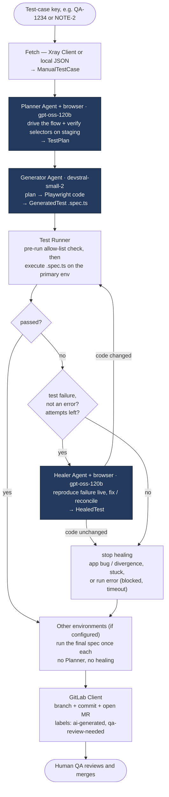
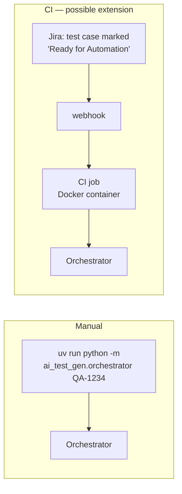
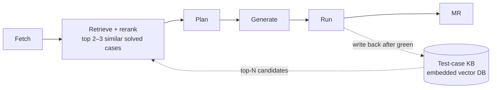

# Workflow — how one test case flows through the pipeline

> The run-time view: what happens, in what order, and which agent is called when.
> For the component/structure view, see [ARCHITECTURE.md](ARCHITECTURE.md).

The whole pipeline processes **one test case at a time** — fetched live from Jira/Xray, or read from a local raw-Xray-shaped JSON file when `TESTCASE_SOURCE=local` (the path the bundled demo uses). The Orchestrator runs this sequence: **fetch → plan → generate → run → (heal ↺) → (run on other environments) → open MR**. When `STAGING_BASE_URL` lists several environments, everything up to the heal loop happens on the **primary** (first) one; the final spec then runs once on each of the others.

## End-to-end flow


```mermaid
flowchart TD
    START([Test-case key, e.g. QA-1234 or NOTE-2]) --> FETCH

    FETCH["Fetch — Xray Client or local JSON<br/>→ ManualTestCase"] --> PLAN
    PLAN["Planner Agent + browser · gpt-oss-120b<br/>drive the flow + verify selectors on staging<br/>→ TestPlan"] --> GEN
    GEN["Generator Agent · devstral-small-2<br/>plan → Playwright code<br/>→ GeneratedTest .spec.ts"] --> RUN

    RUN["Test Runner<br/>pre-run allow-list check, then<br/>execute .spec.ts on the primary env"] --> Q1{passed?}
    Q1 -- yes --> ENVS
    Q1 -- no --> Q2{test failure,<br/>not an error?<br/>attempts left?}
    Q2 -- yes --> HEAL["Healer Agent + browser · gpt-oss-120b<br/>reproduce failure live, fix / reconcile<br/>→ HealedTest"]
    HEAL -- code changed --> RUN
    HEAL -- code unchanged --> FLAG
    Q2 -- no --> FLAG["stop healing<br/>app bug / divergence, stuck,<br/>or run error (blocked, timeout)"]
    FLAG --> ENVS
    ENVS["Other environments (if configured)<br/>run the final spec once each<br/>no Planner, no healing"] --> MR

    MR["GitLab Client<br/>branch + commit + open MR<br/>labels: ai-generated, qa-review-needed"] --> REVIEW([Human QA reviews and merges])

    classDef agent fill:#23395d,color:#fff,stroke:#0d1b2a;
    class PLAN,GEN,HEAL agent;
```

**Agents are blue.** Note the two browser-driving agents (Planner, Healer) and the single non-browser one (Generator). The loop back from Healer to Runner is the self-healing retry.

**Planner refusals short-circuit the run.** The Planner is instructed to refuse unclear or unsafe cases (forbidden routes, PII, production) by returning a plan with **no steps** and the reason in `notes`. The Orchestrator stops right there — no generation, no run, no heal attempts, no MR — and reports `status: refused` with those notes. The plan JSON is still saved for audit.

## Which agent is called when

```mermaid
sequenceDiagram
    autonumber
    participant O as Orchestrator
    participant X as Xray Client
    participant P as Planner · gpt-oss-120b
    participant B as Staging app (via MCP)
    participant G as Generator · devstral
    participant R as Test Runner
    participant H as Healer · gpt-oss-120b
    participant L as GitLab

    O->>X: fetch(issue_key)
    X-->>O: ManualTestCase
    O->>P: plan_test_case(case)
    P->>B: drive flow (fill/submit) + browser_generate_locator
    B-->>P: verified locators (id / accessible / css / xpath) + observed outcomes
    P-->>O: TestPlan
    O->>G: generate_test(plan)
    G-->>O: GeneratedTest (.spec.ts)
    O->>R: run_test(test)
    R->>B: execute .spec.ts
    R-->>O: TestRunResult

    loop while status is failed (never error), up to MAX_HEAL_ATTEMPTS; stops on unchanged code
        O->>H: heal_test(test, failure, plan, case, heal history)
        H->>B: log in + reproduce failure live + browser_generate_locator
        B-->>H: correct locators + observed behavior
        H-->>O: HealedTest
        O->>R: run_test(healed)
        R-->>O: TestRunResult
    end

    loop each other STAGING_BASE_URL environment
        O->>R: run_test(final test, base_url=env)
        R-->>O: TestRunResult (reported, never healed)
    end

    O->>L: open_mr(test, plan, per-environment results)
    L-->>O: MR URL
```

## Stage by stage

| # | Stage | Who | In → Out | Touches | ~Time |
|---|---|---|---|---|---|
| 1 | Fetch | Xray Client *or* local JSON loader | test-case key → `ManualTestCase` | Jira/Xray API, or a local JSON file | <1s |
| 2 | Plan | **Planner** (+MCP) | case → `TestPlan` (verified selectors + page context) | drives staging in a browser (fills, submits) | 30–90s |
| 3 | Generate | **Generator** | `TestPlan` → `GeneratedTest` (guarded `test.step`s, container-scoped locators) | none (writes file) | 10–20s |
| 4 | Run | Test Runner | test → `TestRunResult` | runs the test on staging | 10–60s |
| 5 | Heal *(only if step 4 failed)* | **Healer** (+MCP) | failed test + error + plan + intent → `HealedTest`, then back to step 4 | drives staging (logs in, reproduces the failure) | 30–60s / attempt |
| 6 | Other environments *(only with several `STAGING_BASE_URL` entries)* | Test Runner | final test → one `TestRunResult` per secondary environment | runs the test on each other environment | 10–60s / env |
| 7 | Open MR *(skipped if `GITLAB_ENABLED=false`)* | GitLab Client | per-attempt test revisions + plan (+ per-environment results) → MR URL | pushes branch, one commit per attempt, opens MR | <2s |

**Total: about 10 minutes per test case in practice.** The per-stage figures above are best cases; model latency, Planner exploration depth and heal attempts dominate real runs.

## The heal loop, explained

- The Runner **never throws on a failing test** — a failure is a *healable state*, not a crash. (A genuinely hung run is caught by a hard whole-run timeout and reported as `status=error`, so the pipeline can't wedge. A test that hits Playwright's own per-test or action timeout is an ordinary `failed` run.)
- **Compile errors go to the Generator first.** A run in which no test actually executed (`did_run=false` — the spec failed to compile/load/collect, so the JSON report has no test results and the error sits in its top-level `errors` array, or no report was produced at all) goes back to the **Generator** for one regeneration with its own code + the real error text. No browser is involved in that retry. If the regenerated spec still fails — including a compile error that persists — it enters the normal heal loop (the Healer receives the same error text) and then the MR, so a human always sees the result.
- While the run's status is `failed`, the Orchestrator calls the Healer up to **`MAX_HEAL_ATTEMPTS = 3`** times (env-overridable). **A heal attempt that crashes** — an agent/gateway/MCP exception, e.g. a tool exceeding its retry budget or a model request that got no response within `AGENT_REQUEST_TIMEOUT_S` on every try — **consumes its attempt but does not end healing**: each attempt builds a fresh Healer + browser, so the next one starts clean. A crashed attempt changed no code, so it adds nothing to the heal history the next attempt sees and never counts as the failure "persisting" (see escalation below); its note still appears in the MR. Only two *consecutive* crashed attempts stop the loop early (back-to-back crashes are an environment problem more attempts won't heal), so a generous budget like 15 is actually honored. The Healer is a **full browser agent** like the Planner: it starts with no saved session, so each attempt it logs in fresh and **reproduces the failure live** — re-performing the failing step (submitting forms, creating data, triggering the validation, even signing out / resetting a password if the failure path needs it, all within the non-prod guard) to see what the app actually does. Then it makes the smallest change that turns the test green — usually a selector/wait/URL fix, but it MAY add a step the Generator skipped (including a **recovery step** like a re-fill after a cleared field or a re-login after a sign-out) or drop one it hallucinated, to reconcile the test with its intent. It never re-plans from scratch or adds unrelated test cases.
- **The Healer reconciles against the original intent.** It also receives the `ManualTestCase` and the `TestPlan` (incl. the Planner's `notes`, verified selectors, and each step's plan-time page context — `page_url`, where the step landed / enclosing `container`), so it compares what the test *should* do against the failing code — staying faithful to that intent (never going green by dropping a real check) and capturing any selector it adds live (the resilience ladder id → accessible → CSS → XPath; CSS/XPath authored for the lower rungs are verified to resolve before use), never inventing one.
- **Repeat guidance depends on the failure kind.** The Orchestrator fingerprints each failure — failing test + the enclosing `test.step` title (not the line number, which shifts when a heal adds a step) + the failure **kind**, *ignoring* the specific selector — and counts how many completed heals in a row the same fingerprint survived. The kind comes from the Playwright error text (`classify_failure` in `test_runner.py`): **locator** (a strict-mode violation, an `expect(locator)` whose element was not found — e.g. a step's pre-action `toBeVisible()` guard reporting `element(s) not found` — or an action timing out while waiting for a locator), **assertion** (an `expect` on a *found* element or the page whose value/state differs: `toHaveText`, `toHaveValue`, `toBeDisabled`, `toHaveURL`, counts…), **navigation** (`page.goto` / `waitForURL` / `net::ERR_*`), or **other** — which also covers an element that was found but is hidden (`Received: hidden`), since that can mean either a locator matching a hidden duplicate or a missing prior step such as opening a menu, and the Healer settles it by replaying the flow live. When a **locator** failure persists, re-trying the same kind of locator isn't working, so the heal message tells the Healer to **descend the resilience ladder to a different kind** — e.g. roll a persistently-failing (often hallucinated) id over to a verified `locator('xpath=…')`, exactly what a human QA engineer does for an inaccessible element. When an **assertion** failure persists, changing locators won't help: the message says the app may genuinely differ from the test case — keep the assertion faithful, re-check the intent, and report the divergence. Other kinds get a plain "re-diagnose from the top". A failure that moved on to a later step is not a repeat. This is why the cap is 3: one attempt to confirm the failure recurs, another to act on it.
- **Each attempt sees the previous attempts' changes.** The accumulated `changes_summary` history of the completed attempts is in the heal message with an explicit "the code already contains these changes — don't undo them" instruction, so a whole-file rewrite on attempt 2 builds on attempt 1 instead of ping-ponging back.
- **Diagnosis starts at the line the run died.** The runner extracts the failing line from the Playwright report (`error_line`), and the heal message quotes it with an explicit boundary: code after it **never executed** (don't "fix" it for this failure), code before it may have silently mis-acted — a wrong early locator usually surfaces as a *downstream* timeout. The Healer replays the test's locators in order from the top (login first) to find the first real blocker.
- **Generated tests guard each step, so failures localize.** Each plan step is wrapped in ``test.step(`<action>`, …)`` with a pre-action `expect(target, '…').toBeVisible()` before it acts and — for steps that open a modal/menu or navigate — a post-action state assert after. When the case's expected result names a value or state (a title, a disabled button, a removed row), that assert uses the matching matcher — `toHaveText`, `toBeDisabled`, `toBeHidden` — not just `toBeVisible`. A missing element fails fast at the expect timeout with a labeled message instead of a 60s click timeout, and a step that fails to open a modal fails on its OWN line. The Healer reads which guard fired: a failed pre-action guard means a wrong locator *or* a prior step whose effect never landed; a failed post-action assert means this step's own trigger didn't work.
- **The heal message carries guidance for the failure type** — picked by the code from the error text, not listed in the Healer's system prompt: a **strict-mode violation** (`resolved N elements`) is fixed by making the name match `exact: true` or scoping to the active dialog; an element that was **not found** is often an earlier wrong locator, a guessed role on a `<div>`/`<span>`, or a text literal in the other language; a **navigation** failure means a wrong URL; an **assertion** on a found element may be a real app difference; anything else (a hidden element, a script error) is replayed live from the top. When the app declares an **activation flow**, both browser agents also get its rules: a test that creates an account and never activates it gets the missing activation steps ADDED, rather than the Healer blaming the selector. It captures selectors live (`browser_generate_locator`, or a verified CSS/XPath for inaccessible elements) rather than hand-writing them.
- The Healer is told to **leave the test unchanged if the failure is a genuine app bug** rather than a selector problem — so a real regression surfaces honestly instead of being "fixed" away. This covers a **spec-vs-reality divergence**: if reproducing the flow shows the app genuinely behaves differently from what the test case demands (the case expects a disabled button, the app keeps it enabled with a validation message), the Healer keeps the assertion faithful to the test case and explains the divergence in `changes_summary` rather than weakening it to go green. **Returning the code unchanged ends healing**: re-running identical code could only fail the same way, so the Orchestrator writes no attempt file and no MR commit for it, and records the verdict "Healer found no fix — probable app bug or spec divergence" (with the Healer's `changes_summary`) as `heal_verdict` in the run summary and on the MR description. The comparison ignores trailing whitespace and line endings.
- **A run that errors is never healed.** Only `status: failed` goes to the Healer. `status: error` means the run itself broke — Playwright could not launch, the whole-run timeout fired, or the run was **blocked**: before Playwright starts, every run checks the spec's literal `goto(...)` targets and the plan's recorded URLs against the navigation allow-list (the configured environments + `STAGING_EXTRA_URLS`), and an off-list target fails that run with `status: error` and `blocked: true`. None of these is a test problem the Healer can fix (leaving the allowed hosts is a safety stop), so the loop ends — also when a re-run after a heal errors — the error is logged, and it reaches the reviewer as `heal_verdict` in the run summary and the MR description.
- **One spec, many environments.** The Generator emits baseURL-relative navigation for the app's own pages (`page.goto('/')`, `page.waitForURL('/notes')`); the runner sets `BASE_URL` per run and `output/playwright.config.ts` maps it to `use.baseURL`. After the heal loop the final spec runs once on every other `STAGING_BASE_URL` environment — no Planner, no Healer. A failure there is a real environment difference: it is logged, added to the run summary's `environments` list (URL, status, one-line error), and listed in the MR description; the run's overall `status` stays the primary's. With one environment, the flow and the summary are unchanged.
- **The agents stay on the allowed hosts.** In the Planner's and Healer's browser, `browser_navigate` to an off-list host is refused (the agent is told the allowed hosts and not to retry), and a click or redirect that lands off-list gets a navigate-back warning — both logged at WARNING. A host the app legitimately needs (an SSO login, a mail-catcher) goes in `STAGING_EXTRA_URLS`.
- **If it still fails when the attempts run out, the MR is opened anyway.** Healing is a convenience, not a gate — a human reviews every result regardless. The MR labels (`ai-generated`, `qa-review-needed`) and the committed plan JSON give the reviewer full context.
- **A stuck locator can't sink an attempt.** `browser_generate_locator` failures are guarded on both browser agents: at the retry ceiling (`AGENT_MCP_RETRIES`) the agent is handed give-up-this-element guidance — descend the ladder with an authored + verified CSS/XPath, use `probe_dom` when enabled, or record the gap and move on — instead of the run dying with "exceeded max retries". With vision on, a steer to `inspect_screen` fires earlier in the streak (`PLANNER_LOCATOR_STEER_AFTER`, default 3); it stops being offered once the run's vision budget is spent or the vision backend fails.
- **Reviewers see the heal history.** Each attempt's `changes_summary` (crashed attempts included), the heal count, the final status, and — when healing stopped without a pass for a reason other than running out of attempts — the heal verdict are rendered into the MR description — tests that needed multiple rounds are easy to spot and scrutinize.
- **Every iteration is kept on disk, and the MR shows the full attempt chain.** The first generated spec keeps its name in `output/tests/`; the compile-retry regeneration and each heal attempt are written to their *own* sibling files — `<name>.regen.spec.ts`, `<name>.healer-attempt-1.spec.ts`, `<name>.healer-attempt-2.spec.ts` — so no iteration overwrites another and the whole heal history stays inspectable locally. The MR then commits **one commit per attempt to a single file path** under the original first-iteration filename (initial generation → optional regen → each heal; the Healer's own returned `file_name` is deliberately ignored). A reviewer opens the MR's commit view and diffs one attempt against the next — each commit's subject names the attempt (`[AI] QA-1: heal attempt 2`) and the Healer's `changes_summary` is in the commit body. A heal that returns the code unchanged ends the loop and gets neither a file nor a commit, so there are no empty commits.
- **Run housekeeping.** At the start of every run the Orchestrator empties `output/snapshots/` (the regenerated MCP snapshot/png output, kept out of git via a `.gitkeep` + ignored contents), and it stamps the saved plan JSON with a `context_hash` (sha256 of `project_context.md` + `project_map.md`) so a plan built against stale context is auditable later.
- **Every run is logged to disk.** Each `run_one.py` invocation writes a log to `output/runs/run-<issue-key>-<timestamp>.log` (gitignored); the path is printed at the start and end of the run. The file captures **INFO by default** (`--verbose` only raises *console* verbosity), which records every pipeline step and every failure — the Planner/Healer exception text, including the gateway's error body, is logged at WARNING/ERROR. It deliberately does **not** replay the agents' conversations (the large accessibility snapshots stay in memory), so it stays small and easy to read or share when a run fails. Set `RUN_LOG_LEVEL=DEBUG` for a deeper dive. Third-party HTTP loggers (`httpx`/`openai`) are pinned to WARNING so the file stays readable and never records the gateway request headers (which carry the API key).
- **Every run reports its model usage.** Each agent run — the Planner, the Generator (and its compile-retry regeneration, `Generator retry`), each heal attempt (`Healer attempt N`), and each Vision Aid call made inside an agent run (`Planner vision`, `Healer attempt N vision`) — logs one INFO line when it ends, e.g. `Planner usage: 41 requests, in=512,340 out=6,210 tokens, 4m03s`, with `(aborted)` appended when the run failed. The numbers are pydantic-ai's own per-response counts, so a run that aborts (request limit, timeout, retry exhaustion, gateway error) still reports what it spent up to the failure. Every run summary carries a `usage` key — `agents` (one record per label, so an agent run's Vision Aid calls merge into one record: `agent`, `model`, `runs`, `requests`, `tool_calls`, `input_tokens`, `output_tokens`, `cache_read_tokens`, `reasoning_tokens`, `reasoning_only_retries`, `wall_s`, `outcome` `ok`/`error`) and `total` (the summed counters plus the whole run's `wall_s`, test runs included) — plain JSON-serialisable data for comparing runs, e.g. before and after a prompt change. The run log ends with the total and a per-agent table, and `run_one.py` prints the same table:

  ```text
  agent             model                  requests       in     out  nudges   wall
  Planner           gpt-oss-120b                 41  512,340   6,210       2  4m03s
  Planner vision    devstral-small-2-2512         3    4,812     240       0   7.4s
  Generator         devstral-small-2-2512         1    9,120   1,804       0  21.3s
  Healer attempt 1  gpt-oss-120b                 18  201,877   3,002       5  1m35s  (aborted)
  Healer attempt 2  gpt-oss-120b                 12  140,551   2,210       0  1m11s
  total                                          75  868,700  13,466       7  8m32s
  ```

  `nudges` counts replies that held only reasoning — the model wrote its tool call inside its reasoning and never made it — and got a retry prompt naming that (see "A reasoning-only reply gets a retry prompt" in [ARCHITECTURE.md](ARCHITECTURE.md)); they spend the cumulative `AGENT_OUTPUT_RETRIES` budget. `requests` counts completed model responses; a request that failed without a response has no token counts to report. Token figures are whatever the gateway returns in its `usage` block. An agent's wall time includes starting its browser; a Vision Aid call's time is also inside its owning agent's time, so the per-agent wall times are not summed.
- **Working-memory trimming (Planner & Healer) — optional, off by default.** The browser agents *can* trim stale page snapshots from their conversation history (`SNAPSHOT_HISTORY_KEEP` enables it; milestone pages where locators were captured are anchored, transit frames stubbed, captured locators never trimmed). It ships **disabled**: live runs showed plan quality degrade with trimming on, so the full history is the default. See the trimming bullet in [ARCHITECTURE.md](ARCHITECTURE.md) and `.env.example`.
- **Vision Aid sensor (Planner & Healer) — optional, off by default.** Set `AGENT_VISION=N` (single shared knob) to give **both** text-only browser agents an `inspect_screen` tool: it screenshots the page and asks the **Vision Aid Agent** (`VISION_MODEL`) to describe what is actually rendered — useful when the accessibility snapshot is silent about visual state (did a dropdown open? is a modal/overlay covering the page? did a toast appear? is the button greyed out?). Every answer carries two labeled parts — `Answer:` (the question, with a wrong premise flagged explicitly) and `On screen:` (what the page actually shows) — so a disoriented agent asking the wrong question still gets re-oriented instead of just hearing "no". The budget is **per agent run**: N calls per planning run *and* N per heal attempt (each lifecycle starts fresh — not one shared pool), so a test with 3 heal attempts may use up to 3×N total, by design. It is a sensor only — the image never reaches the agent, and it never produces a selector (targeting stays on `browser_generate_locator`). It describes the exact screenshot file the capture reports saving; a check left without a usable screenshot logs at ERROR (`Vision Aid is not working in this run: …`), and the run summary gains a `vision` line counting checks vs checks without a screenshot per agent (heal attempts pooled). Unset/`false` leaves both agents identical to before; requires a multimodal gateway model. On repeated failure each agent also self-corrects: after N consecutive `browser_generate_locator` failures (`PLANNER_LOCATOR_STEER_AFTER`, default 3) it is steered to `inspect_screen` (which captures the page itself) and re-orient instead of hammering the locator to the retry ceiling; once the run's vision budget is spent or the vision backend fails, the steer stops pointing at `inspect_screen`. See the vision bullet in [ARCHITECTURE.md](ARCHITECTURE.md) and `.env.example`. (A complex failure-path repro plus vision adds turns — if a run reports `UsageLimitExceeded` mid-heal, raise `AGENT_REQUEST_LIMIT`.)
- **DOM Probe (Planner & Healer) — optional, off by default.** Set `AGENT_DOM_PROBE=N` to give both browser agents a read-only `probe_dom(text, scope?)` tool for barely-accessible apps: it searches the live DOM for elements matching visible text/attributes — the elements the accessibility snapshot renders as unnamed `generic` nodes — and returns their real tag/id/classes/attributes plus *candidate* CSS/XPath selectors with match counts (flagging shadow-DOM/iframe placement). Candidates are recon only: the agent verifies one via `browser_generate_locator` before recording it. One fixed, pipeline-authored JS function does the searching; the model only supplies the text, so this reopens none of the code-exec surface that keeps `browser_evaluate` hidden. Budget is per agent run; no extra model needed. See the DOM Probe bullet in [ARCHITECTURE.md](ARCHITECTURE.md) and `.env.example`.
- **Selector uniqueness check (Planner & Healer) — always on.** Before recording a CSS/XPath it authored, the agent passes it raw to `browser_generate_locator` (which errors on zero matches but silently takes the first of several) and to `count_matches(selector)`, which must report exactly one element. `count_matches` runs one fixed, read-only JS function with the selector as data (light DOM plus open shadow roots), so like the DOM Probe it does not expose `browser_evaluate` to the model.
- **GitLab is optional.** With `GITLAB_ENABLED=false` (e.g. a local Docker run) the pipeline stops after the run/heal loop and leaves the test + plan in `output/` — no branch, no MR (default is `true`, so a normal run still opens one). The direct-connect proxy policy covers the Xray + GitLab `requests` clients too, so the container reaches them without an env proxy.

## What triggers a run


```mermaid
flowchart LR
    subgraph now[" Manual "]
        CLI["uv run python -m<br/>ai_test_gen.orchestrator QA-1234"] --> ORCH1[Orchestrator]
    end
    subgraph later[" CI — possible extension "]
        JIRA["Jira: test case marked<br/>'Ready for Automation'"] --> HOOK[webhook] --> CI["CI job<br/>Docker container"] --> ORCH2[Orchestrator]
    end
```

- **Manual:** run it by hand, one Jira key at a time. Each agent and the generated test log in live from the `project_context.md` dummy creds (context-driven auth — no saved session); any data a test *creates* is randomized at run time, so the same test can be replayed in regression without colliding. The same container image runs **standalone for local generation** (`docker compose run --rm pipeline QA-1234`), with `GITLAB_ENABLED=false` to skip the MR.
- **CI (a possible extension, not yet built):** a Jira status change webhooks a CI job, which runs the same Orchestrator inside a locked-down container — one job per test case, fanned out for batches.

## How this grows (planned)

- **Translator (4th agent).** For migrating the existing Selenium suite: `Selenium test → Translator (+MCP) → Playwright test → Runner → (Healer) → MR`. Same pipeline shape, different front door.
- **Retrieval memory — an embedded test-case knowledge base + a reranker.** The pipeline keeps every case it solves — the manual case's text, the verified `TestPlan` (selectors included), the final green spec — in an **embedded vector database** (an in-process library persisting to a local directory; no extra service to run; one collection per target project). The KB is seeded offline by a **Distiller agent** that mines the existing corpus — the Selenium suite included, for its selectors and flows, never for code style — into the same record shape. A run gains one read step and one write step around the otherwise-unchanged core loop: right after **Fetch**, the new case is embedded (gateway `/embeddings`) and the KB returns the top-N most similar solved cases; a **reranker** (`zerank-1-small`, a cross-encoder on the gateway's `/rerank`) narrows them to the 2–3 genuinely relevant ones, which are injected as context: plans + verified-selector *hints* for the Planner, finished specs as few-shot examples for the Generator ("write something that looks like these" markedly improves mid-tier output). After a green run the solved case is written back, so the memory compounds — every solved case makes the next one faster and cheaper. Off by default (`RAG_ENABLED`), fail-open (KB or reranker unreachable → the run proceeds exactly as today), and hints are never trusted blindly — live selector verification is unchanged. Full design: the "Planned: retrieval memory" section in [ARCHITECTURE.md](ARCHITECTURE.md).


```mermaid
flowchart LR
    FETCH[Fetch] --> RET["Retrieve + rerank<br/>top 2–3 similar solved cases"] --> PLAN[Plan] --> GEN[Generate] --> RUN[Run] --> MR[MR]
    KB[("Test-case KB<br/>embedded vector DB")] -. top-N candidates .-> RET
    RUN -. write back after green .-> KB
```
